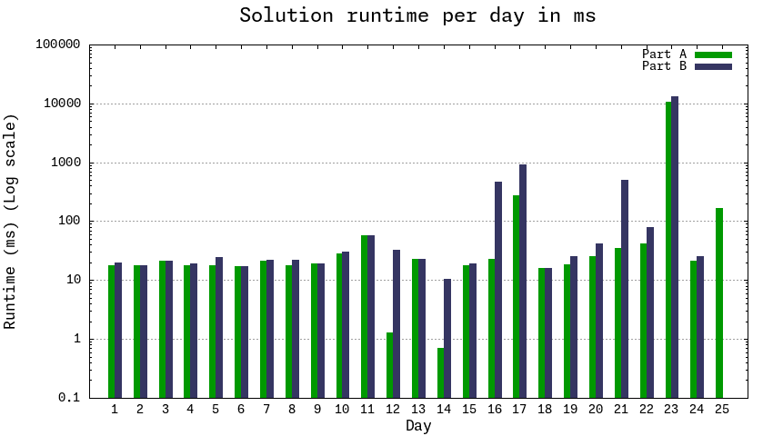

# Advent of Code 2023

https://adventofcode.com/2023 by [Eric Wastl](http://was.tl/)

Solutions using TypeScript \w Deno v1.38

### 1. Requirements

- Deno https://docs.deno.com/runtime/manual/getting_started/installation

### 2. Running

Go to the folder of the desired day

`cd 01`

Run part A or B, while allowing all permissions

`deno run -A a.ts`

### 3. Testing

`cd 01`

`deno test -A .`

### 4. Debugging

Debugging in Visual Studio Code

1. Open the desired file in the editor

2. Set breakpoints

3. Press F5

### 5. Days

1. [**Trebuchet?!**] Checking strings for first and last appearances of
   substrings
2. [**Cube Conundrum**] Bag & cube game, parsing input lines by extracting
   numbers
3. [**Gear Ratios**] Parsing a giant grid with multi column numbers
4. [**Scratchcards**] Lidl recursion on scratchcard winnings
5. [**If You Give A Seed A Fertilizer**] 😠 Collapsing multiple ranges of very
   large numbers
6. [**Wait For It**] Quick maths with quadratic formula
7. [**Camel Cards**] Poker with joker cards
8. [**Haunted Wasteland**] Simultaneous node traversal with LCM
9. [**Mirage Maintenance**] Predicting next value of number sequence via
   extrapolation
10. [**Pipe Maze**] 😠 Grid problem with multiple connected pipes creating a
    single continuous loop. Using a parity counter to keep track of passed walls
    to calculate area inside the loop.
11. [**Cosmic Expansion**] Calculating distances of all combinations of items in
    an expanding grid.
12. [**Hot Springs**] Generating and validating arrangements of strings with
    joker characters
13. [**Point of Incidence**] 😠 Finding lines between columns and rows on grids
    to fold over and create a mirror image
14. [**Parabolic Reflector Dish**] Rolling balls NESW on a tilting grid, cycle
    detection to prevent doing this a literal billion times.
15. [**Lens Library**] Creating a simple hashing function & some simple array
    operations (Did day 5 and 15 get swapped..?)
16. [**The Floor Will Be Lava**] Manouvering a light beam through a grid of
    lasers with offset mirrors, tricky rotations.

### 6. Solution runtime

